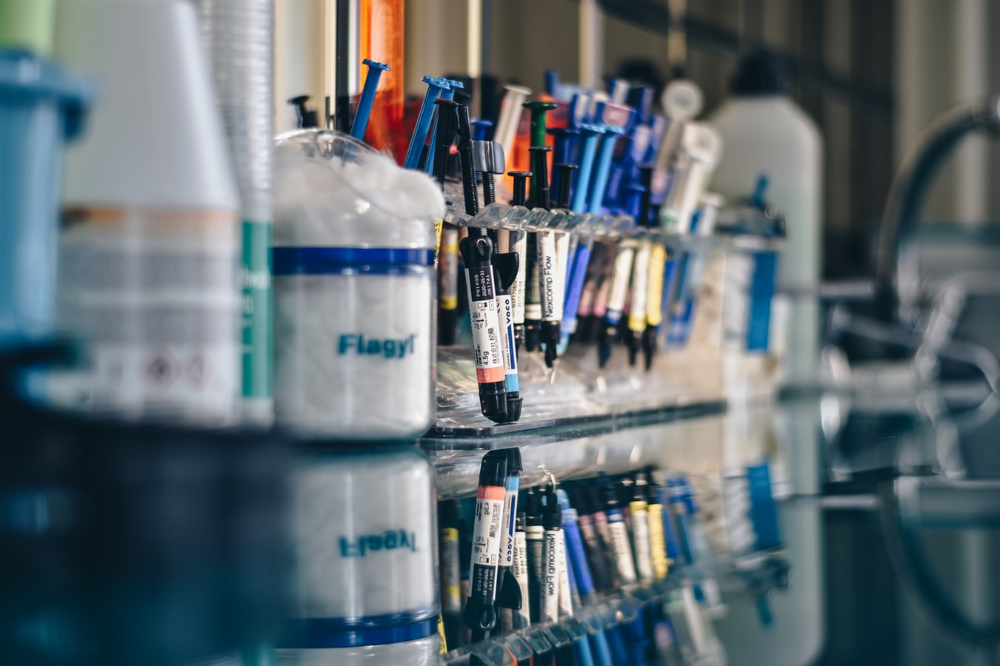

# Eric's Lab Notes

### Welcome to my lab notes! 🙂 

**My name is** [**Eric**](https://etreacy.me)**, and welcome to my digital lab notes!** 👍 

Here you will find most online sources that I  use in my lab: vendors, SOPs \(need Dropbox access\), references, links, training and more. 

This page runs on GitBook. All updates and changes  \(gits\) are found on [GitHub](https://github.com/erictreacy/lab). Feel free to make a pull request to edit, if you please. If it seems like something I could use, I'll add it. 😉 

 

